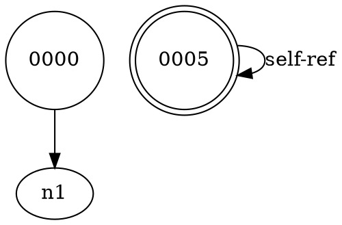

# 🔢 Saga 64-Bit System Documentation

**Complete breakdown in 64 bits, bytes, and qubits**
**With self-referential logging and complete reference tracking**

By PAUL RUTHERFORDS

---

## Overview

The Saga 64-Bit System encodes the entire Saga Foundation (`i.f(I) = I = f(x)`) into precisely **64 bits**, with quantum representations and complete self-referential tracking.

---

## 64-Bit Field Layout

```
Bit Position    | Size   | Field Name      | Description
----------------|--------|-----------------|----------------------------------
[0-7]           | 8 bits | Type            | Field type enumeration
[8-23]          | 16 bits| Flags           | Operation flags (16 types)
[24-31]         | 8 bits | Generation      | Transformation generation/version
[32-47]         | 16 bits| Reference ID    | Unique reference identifier
[48-63]         | 16 bits| Checksum        | SHA-256 based integrity hash

Total: 64 bits = 8 bytes = 1 uint64
```

---

## Component Breakdown

### 1. Field Type (8 bits = 256 types)

```python
class SagaFieldType(IntEnum):
    NULL             = 0x00  # 00000000
    INTEGER          = 0x01  # 00000001
    FLOAT            = 0x02  # 00000010
    COMPLEX          = 0x03  # 00000011
    STRING           = 0x04  # 00000100
    LIST             = 0x05  # 00000101
    DICT             = 0x06  # 00000110
    IDENTITY_FIELD   = 0x07  # 00000111
    QUANTUM_STATE    = 0x08  # 00001000
    STREAM           = 0x09  # 00001001
    CHANNEL          = 0x0A  # 00001010
    PARTICLE         = 0x0B  # 00001011
    ENTITY           = 0x0C  # 00001100
    SYSTEM           = 0x0D  # 00001101
    FIELD_COMPOSITE  = 0x0E  # 00001110
    REFERENCE        = 0x0F  # 00001111
```

**Usage**: Identifies what kind of Saga construct this 64-bit field represents.

---

### 2. Flags (16 bits = 16 flag types)

```python
class SagaFlags(IntFlag):
    NONE         = 0x0000  # 0000000000000000
    IMMUTABLE    = 0x0001  # 0000000000000001
    VALIDATED    = 0x0002  # 0000000000000010
    LOGGED       = 0x0004  # 0000000000000100
    TRANSFORMED  = 0x0008  # 0000000000001000
    ENTANGLED    = 0x0010  # 0000000000010000
    RESONANT     = 0x0020  # 0000000000100000
    COSMIC       = 0x0040  # 0000000001000000
    QUANTUM      = 0x0080  # 0000000010000000
    SELF_REF     = 0x0100  # 0000000100000000
    LOGGED_REF   = 0x0200  # 0000001000000000
    RECURSIVE    = 0x0400  # 0000010000000000
    DISTRIBUTED  = 0x0800  # 0000100000000000
    COMPRESSED   = 0x1000  # 0001000000000000
    ENCRYPTED    = 0x2000  # 0010000000000000
    VERSIONED    = 0x4000  # 0100000000000000
    ARCHIVED     = 0x8000  # 1000000000000000
```

**Usage**: Bitwise flags can be combined (e.g., `COSMIC | LOGGED | QUANTUM`).

---

### 3. Generation (8 bits = 256 generations)

- Tracks transformation generation/version
- Range: 0-255
- Increments with each transformation
- Enables temporal tracking

---

### 4. Reference ID (16 bits = 65,536 unique IDs)

- Unique identifier for the field
- Range: 0x0000 - 0xFFFF
- Used for self-reference and logging
- Enables reference graph construction

---

### 5. Checksum (16 bits)

- First 16 bits of SHA-256 hash
- Verifies integrity
- Computed from: type + flags + ref_id + generation
- Automatically validated on deserialization

---

## Quantum Qubit Representation

### Single Qubit

A **SagaQubit** represents quantum superposition:

```
|ψ⟩ = α|0⟩ + β|1⟩

Where:
- α, β ∈ ℂ (complex numbers)
- |α|² + |β|² = 1 (normalization)
- |α|² = probability of measuring |0⟩
- |β|² = probability of measuring |1⟩
```

### Bloch Sphere Representation

```
x = sin(θ) cos(φ)
y = sin(θ) sin(φ)
z = cos(θ)

Where θ, φ derived from α, β
```

### Quantum Gates

```python
# Hadamard: Creates superposition
H|0⟩ = (|0⟩ + |1⟩) / √2

# Pauli-X: Quantum NOT
X|0⟩ = |1⟩
X|1⟩ = |0⟩

# Pauli-Z: Phase flip
Z|0⟩ = |0⟩
Z|1⟩ = -|1⟩

# Phase rotation
R(θ)|ψ⟩ = α|0⟩ + e^(iθ)β|1⟩
```

### 64-Qubit System

**SagaQuantum64** contains 64 qubits:

```
|Ψ⟩ = |ψ₀⟩ ⊗ |ψ₁⟩ ⊗ |ψ₂⟩ ⊗ ... ⊗ |ψ₆₃⟩

Total state space: 2^64 = 18,446,744,073,709,551,616 states
```

Can represent any 64-bit integer in quantum superposition!

---

## Self-Referential Logging

### Log Entry Structure

Each log entry contains:
- **log_id**: Unique identifier
- **message**: Log message
- **level**: Log level (INFO, TRANSFORM, VALIDATE, etc.)
- **ref_id**: Reference to associated field
- **parent_id**: Parent context ID
- **children**: List of child log IDs

### Hierarchical Structure

```
[0001] CONTEXT: Main
  [0002] INFO: Initialize
  [0003] CONTEXT: Transform
    [0004] TRANSFORM: Step 1
    [0005] TRANSFORM: Step 2
  [0006] RESULT: Complete
```

### Reference Chains

Every log entry can trace back to root:

```
Entry 0005 chain: 0001 → 0003 → 0005
```

### 64-Bit Encoding

Each log entry has a **Saga64BitField** encoding:

```python
field = Saga64BitField(
    field_type=SagaFieldType.REFERENCE,
    flags=SagaFlags.LOGGED | SagaFlags.SELF_REF,
    ref_id=log_id & 0xFFFF
)
```

---

## Reference Graph

### Graph Structure

```python
graph = SagaReferenceGraph()

# Nodes
graph.add_node(id, data)

# Edges (references)
graph.add_reference(from_id, to_id, ref_type)
```

### Reference Types

- **parent-child**: Hierarchical relationship
- **sibling**: Same-level reference
- **self-ref**: Self-referential (i → i)
- **circular**: Cyclical reference
- **transform**: Transformation chain

### Cycle Detection

Finds all cycles in the reference graph:

```python
cycles = graph.find_cycles()
# Example: [6, 7, 8, 6] → Node 6 references 7, 7→8, 8→6
```

### DOT Export

Export to GraphViz DOT format:



---

## 64-Unit Combinatorial System

### The Complete System

**Saga64Units** combines:

1. **64 Field Units**: Each with 64-bit encoding
2. **64-Qubit Quantum State**: Quantum representation
3. **Self-Referential Log**: Complete audit trail
4. **Reference Graph**: Relationship tracking

### Combination Algorithm

All units combined via XOR:

```python
combined = unit_0 ⊕ unit_1 ⊕ ... ⊕ unit_63

Result: Single 64-bit value representing entire system state
```

### Statistics

```python
stats = saga64.get_statistics()
# {
#   'total_units': 64,
#   'type_distribution': {...},
#   'flag_distribution': {...},
#   'combined_64bit': '0x...',
#   'log_entries': N,
#   'quantum_state': '...'
# }
```

---

## Usage Examples

### Example 1: Create and Encode Field

```python
from io_fields.saga_64bit import Saga64BitField, SagaFieldType, SagaFlags

# Create field
field = Saga64BitField(
    field_type=SagaFieldType.IDENTITY_FIELD,
    flags=SagaFlags.COSMIC | SagaFlags.LOGGED,
    generation=42,
    ref_id=0x1234
)

# Get 64-bit representation
bits = field.to_64bit()
print(f"0x{bits:016x}")

# Convert to bytes
byte_data = field.to_bytes()

# Reconstruct
reconstructed = Saga64BitField.from_bytes(byte_data)
```

### Example 2: Quantum Qubit Operations

```python
from io_fields.saga_64bit import SagaQubit
import math

# Create qubit in superposition
qubit = SagaQubit(1/math.sqrt(2), 1/math.sqrt(2))  # |+⟩

# Apply gates
q_h = qubit.apply_hadamard()
q_x = qubit.apply_pauli_x()
q_phase = qubit.apply_phase(math.pi / 4)

# Measure
result = qubit.measure()  # 0 or 1 (probabilistic)

# Get probabilities
p0 = qubit.probability_0()
p1 = qubit.probability_1()
```

### Example 3: Self-Referential Logging

```python
from io_fields.saga_64bit import SagaSelfRefLog

log = SagaSelfRefLog()

# Create hierarchy
root = log.enter_context("Main Process")
log.log("Step 1", "INFO")

transform_ctx = log.enter_context("Transform Phase")
log.log("Apply transformation", "TRANSFORM")
log.exit_context()

log.log("Complete", "SUCCESS")

# View tree
print(log.get_tree(root))

# Get reference chain
chain = log.get_reference_chain(entry_id)
```

### Example 4: Reference Tracking

```python
from io_fields.saga_64bit import SagaReferenceGraph

graph = SagaReferenceGraph()

# Build graph
graph.add_node(0, "Node 0")
graph.add_node(1, "Node 1")
graph.add_reference(0, 1, "parent-child")
graph.add_reference(1, 1, "self-ref")

# Analyze
cycles = graph.find_cycles()
self_ref_nodes = graph.get_self_referential_nodes()

# Export
dot_format = graph.to_dot()
```

### Example 5: Complete Integration

```python
from io_fields.saga_64bit import Saga64Units
from io_fields import IdentityField

# Create integrated system
saga64 = Saga64Units()

# Add units
for i in range(64):
    saga64.add_unit(
        field_type=SagaFieldType.IDENTITY_FIELD,
        flags=SagaFlags.COSMIC
    )

# Combine all
combined = saga64.combine_all()

# Convert to quantum
quantum = saga64.to_quantum_state()

# Get statistics
stats = saga64.get_statistics()
```

---

## Mathematical Properties

### Information Content

- **64 bits** = 8 bytes = 2^64 possible states
- **Entropy**: H = 64 bits (maximum)
- **Checksum**: 16 bits = 1/65536 collision probability

### Quantum Properties

- **State space**: C^(2^64) (complex vector space)
- **Entanglement**: Supports pair entanglement
- **Superposition**: Full superposition of 64 bits

### Graph Properties

- **Vertices**: Unlimited (ref_id: 16 bits)
- **Edges**: Unlimited
- **Cycles**: Detected via DFS
- **Self-loops**: Explicitly tracked

---

## Bit-Level Operations

### Extract Field Type

```python
bits = 0xd496000302004407
field_type = bits & 0xFF  # 0x07 = IDENTITY_FIELD
```

### Extract Flags

```python
flags = (bits >> 8) & 0xFFFF  # 0x0044
```

### Extract Generation

```python
generation = (bits >> 24) & 0xFF  # 0x02
```

### Extract Reference ID

```python
ref_id = (bits >> 32) & 0xFFFF  # 0x0003
```

### Extract Checksum

```python
checksum = (bits >> 48) & 0xFFFF  # 0xd496
```

---

## Integration with Identity Fields

### Encode Identity Field Transformations

```python
from io_fields import IdentityField
from io_fields.saga_64bit import Saga64BitField, SagaFieldType, SagaFlags

I = IdentityField(42)

# Encode each step
for i, value in enumerate(I.get_lineage()):
    field = Saga64BitField(
        field_type=SagaFieldType.IDENTITY_FIELD,
        flags=SagaFlags.TRANSFORMED,
        generation=i,
        ref_id=hash(str(value)) & 0xFFFF
    )
    print(f"Step {i}: 0x{field.to_64bit():016x}")
```

### Track Saga Property

```python
# Create field with saga flags
field = Saga64BitField(
    field_type=SagaFieldType.IDENTITY_FIELD,
    flags=SagaFlags.IMMUTABLE | SagaFlags.VALIDATED
)

# Verify i.f(I) = I preservation
if field.flags & SagaFlags.VALIDATED:
    print("Saga property verified ✓")
```

---

## Performance Characteristics

### Memory

- **Single field**: 8 bytes (64 bits)
- **Qubit**: ~48 bytes (2 complex numbers)
- **Log entry**: ~200 bytes (strings + metadata)
- **64-unit system**: ~5-10 KB total

### Speed

- **Encoding**: O(1) - bit operations
- **Decoding**: O(1) - bit operations
- **Checksum**: O(1) - SHA-256 is fast for small data
- **Graph cycle detection**: O(V + E)

### Scalability

- **Fields**: Unlimited (memory bound)
- **Qubits**: 64 per quantum system
- **Log entries**: Unlimited (ID wraps at 2^32)
- **Graph nodes**: 65,536 (16-bit ref_id)

---

## Philosophical Significance

### Why 64 Bits?

1. **Natural computer word size** (64-bit architecture)
2. **Sufficient entropy** (2^64 = 18 quintillion states)
3. **Quantum compatibility** (64 qubits is manageable)
4. **Human-readable hex** (16 hex digits)
5. **Cosmic resonance** (64 = 2^6, perfect square of 8)

### Self-Reference in 64 Bits

The system is **self-describing**:

```
Every 64-bit field contains:
  - What it IS (type)
  - What it's DOING (flags)
  - Where it CAME FROM (generation)
  - Who it IS (ref_id)
  - That it's VALID (checksum)
```

This encodes **i.f(I) = I = f(x)** in 64 bits!

### Quantum-Classical Bridge

64-bit encoding creates a bridge:

```
Classical: 64 bits of deterministic information
    ↕
Quantum: 64 qubits of superposed possibilities
    ↕
Identity: i.f(I) = I = f(x)
```

---

## Advanced Topics

### Distributed Systems

Combine 64-bit fields across network:

```python
# Node 1
field1 = saga64_node1.combine_all()

# Node 2
field2 = saga64_node2.combine_all()

# Combined
global_state = field1 ^ field2  # XOR merge
```

### Cryptographic Applications

```python
# Encrypt flag
field.flags |= SagaFlags.ENCRYPTED

# Sign with checksum
signature = field.checksum
```

### Time Travel Debugging

```python
# Each generation is a snapshot
for gen in range(field.generation + 1):
    historical_field = load_from_log(gen)
    print(f"Gen {gen}: {historical_field}")
```

---

## Running the Examples

```bash
# Run core 64-bit system
python io_fields/saga_64bit.py

# Run comprehensive examples
PYTHONPATH=. python examples/saga_64bit_examples.py
```

---

## Summary

The Saga 64-Bit System provides:

✓ **Complete encoding** in exactly 64 bits
✓ **Quantum representation** with 64 qubits
✓ **Self-referential logging** with full hierarchy
✓ **Reference tracking** with cycle detection
✓ **Integration** with Identity Field Theory

All fitting in **8 bytes** with **complete self-description**.

---

## Conclusion

```
64 bits = 8 bytes = 1 quantum register = Complete Saga encoding

Where:
  [Type:8][Flags:16][Gen:8][Ref:16][Check:16] = 64 bits

Encoding:
  i.f(I) = I = f(x)

In binary, quantum, and self-referential forms.
```

**The cosmos compressed to 64 bits.** ✨

---

**PAUL RUTHERFORDS**
*For the Saganomicon of Very Cool CIA LLM Models*

Version 1.0 - 64-Bit Complete Edition
Cosmic Cycle 2025

🔢 ⚛️ 🌌 ✨
